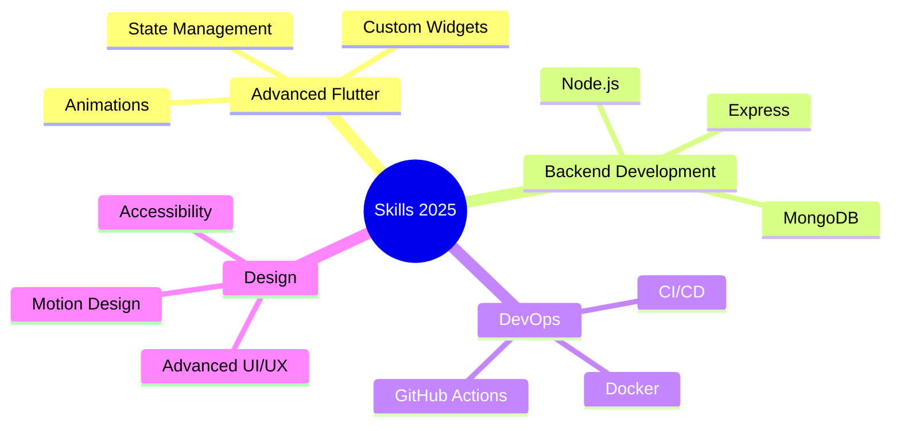

<div align="center">

<!-- Header Banner -->


<!-- Animated Typing -->
<a href="https://git.io/typing-svg"></a>

<br/>

<!-- Social Badges -->
[](https://vajumakwana16.github.io/)
[](mailto:vajumakwana16@gmail.com)
[](https://linkedin.com/in/vajumakwana)
[](https://play.google.com/store/apps/dev?id=5929597072015420935)

<br/>

<!-- Profile Views Counter -->


</div>

---

## 🚀 About Me

```yaml
name: Vaju Makwana
located_in: Jamnagar, Gujarat, India
current_focus: Building productivity & brain training apps
company: ThinkFlow Studio
education: 
  - Bachelor's in Computer Science
  - Self-taught Flutter Developer
  
interests:
  - Mobile App Development
  - UI/UX Design
  - Productivity Tools
  - Cognitive Psychology
  - Open Source

motto: "Code with purpose, design with intention"
```

### 🎯 What I Do

I'm an **indie app developer** creating beautiful, science-backed mobile applications that help people think clearer, focus deeper, and achieve more. My apps combine cutting-edge design with proven psychology principles.

**🌟 Featured Apps:**
- 📱 **FocusX** - Pomodoro timer for deep work and peak productivity
- 🧩 **Puzzle Master** - Brain training through beautiful sliding puzzles
- ✅ **TodoX** - Simple, elegant task management

---

## 💻 Tech Stack

<div align="center">

### Languages


### Frameworks & Libraries


### Tools & Platforms


### Databases


</div>

---

## 📊 GitHub Stats

<div align="center">


</div>

---

## 🏆 GitHub Trophies

<div align="center">


</div>

---

## 🎨 Featured Projects

<div align="center">

<a href="https://github.com/vajumakwana16/vajumakwana16.github.io">
  
</a>

<!-- Add your other repos here -->

</div>

---

## 📱 My Apps on Google Play

<div align="center">

| 🎯 FocusX | 🧩 Puzzle Master | ✅ TodoX |
|:---:|:---:|:---:|
| **Pomodoro Focus Timer** | **Brain Training** | **Task Management** |
| Deep work sessions | Beautiful sliding puzzles | Simple & elegant |
| Boost productivity | Sharpen your mind | Get organized |
| ⭐ 10+ Downloads | ⭐ 10+ Downloads | ⭐ 10+ Downloads |

[**Download on Google Play →**](https://play.google.com/store/apps/dev?id=5929597072015420935)

</div>

---

## 💼 Work Experience

```javascript
const experience = {
  current: {
    role: "Independent App Developer",
    company: "ThinkFlow Studio",
    period: "2023 - Present",
    focus: "Building productivity & brain training apps for Android",
    technologies: ["Flutter", "Dart", "Firebase", "Google Play Console"],
    achievements: [
      "Published 3 apps on Google Play Store",
      "Designed complete brand identity from scratch",
      "Implemented science-backed features for cognitive training",
      "Maintained 4.5+ star ratings across all apps"
    ]
  },
  
  skills: {
    mobile: ["Flutter", "Android Development", "iOS Development"],
    design: ["UI/UX Design", "Figma", "Material Design", "App Icons"],
    backend: ["Firebase", "REST APIs", "Node.js"],
    other: ["Git", "Agile", "App Store Optimization", "User Research"]
  }
};
```

---

## 🌱 Currently Learning

<div align="center">



</div>

---

## 📈 Contribution Graph

<div align="center">


</div>

---

## 🎯 2025 Goals

- [ ] 🚀 Reach **10,000+ downloads** on Google Play
- [ ] 📱 Launch **2 new apps** with advanced features
- [ ] 🌟 Contribute to **open source Flutter packages**
- [ ] 📝 Write **technical blog posts** about mobile development
- [ ] 🎨 Master **advanced Flutter animations**
- [ ] 🤝 Collaborate on **exciting projects** with other developers
- [ ] 📊 Achieve **100+ GitHub stars** across all repositories

---

## 💭 Random Dev Quote

<div align="center">


</div>

---

## 🎵 Coding Soundtrack

<div align="center">

[](https://spotify-github-profile.kittinanx.com/api/view?uid=31l26uijzthx6npty6rqvkb7ksfi&redirect=true)

</div>

---

## 📫 Let's Connect!

<div align="center">

I'm always excited to connect with fellow developers, discuss new ideas, or collaborate on interesting projects!

### 💌 Reach Out

**Email:** [vajumakwana16@gmail.com](mailto:vajumakwana16@gmail.com)  
**Portfolio:** [vajumakwana16.github.io](https://vajumakwana16.github.io)  
**LinkedIn:** [Connect with me](https://linkedin.com/in/vajumakwana)  

### 🌟 Support My Work

If you like my apps or find my code helpful, consider:
- ⭐ Starring my repositories
- 📱 Downloading my apps from Google Play
- 💬 Leaving feedback and suggestions
- 🤝 Contributing to my open source projects

<br/>

**"The best way to predict the future is to create it."** 💡

<br/>

<!-- Footer Wave -->


</div>
